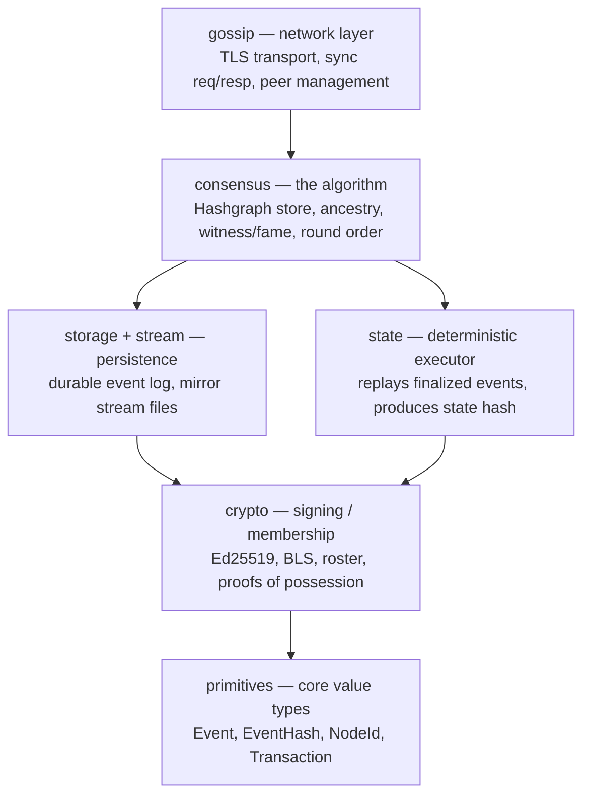
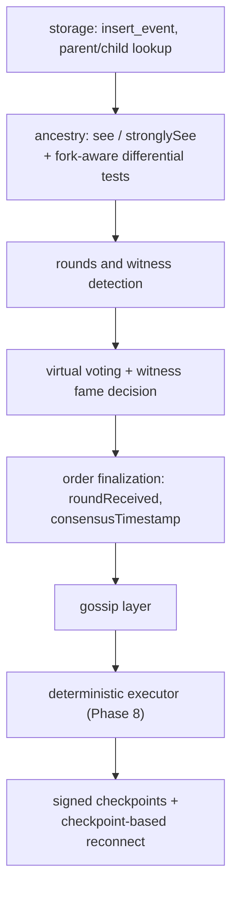
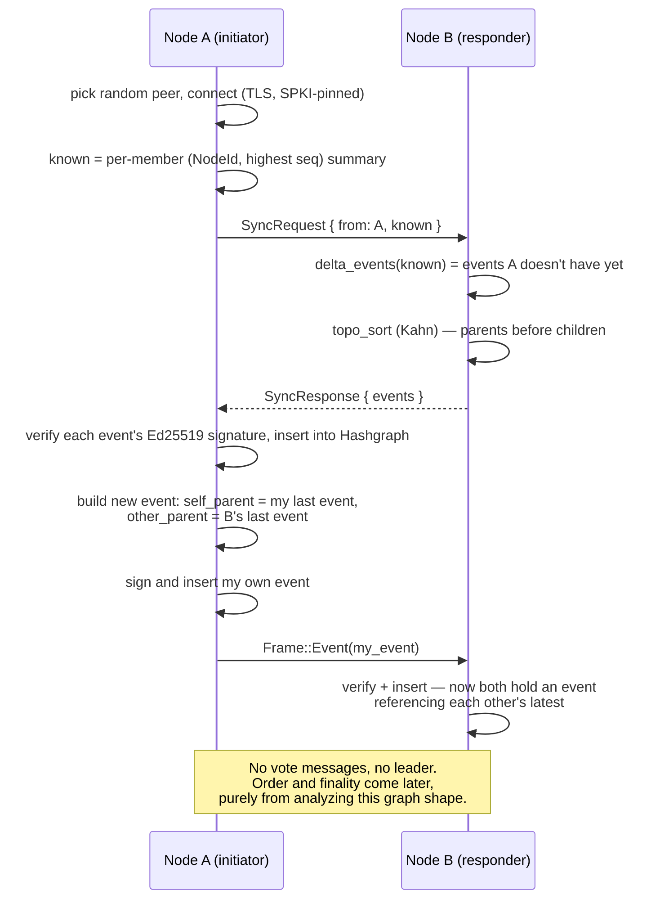

This started as a research project. I was contributing to the Hiero/Hedera ecosystem, and along the way I ran into hashgraph — the consensus algorithm Hedera itself is built on. It's an elegant piece of design: no leader, no block proposer, no forking to resolve — nodes just gossip events to random peers, and consensus order falls out of the graph structure itself once enough of the network has "seen" and "seen-seen" the same events.

I got curious enough that curiosity wasn't going to be satisfied by reading about it. I read the original hashgraph papers, studied how Hedera's own consensus node implements it, and then decided the only way I'd actually understand it — not just the diagram-level idea, but the actual mechanics of virtual voting, witness selection, round creation — was to build one myself.

The goal was never "ship a blockchain." It was to understand hashgraph deeply enough to reproduce it. Everything else — the checkpointing, the mirror node, the executor — grew out of needing those pieces to actually test whether the consensus core was correct.

The repo: **[JX / JKaIN](https://github.com/Jashk120/JX/tree/develop)**

## What it is

JKaIN is a monorepo. The consensus engine itself — the part I care most about — is a Rust workspace split into crates that mirror the actual dependency structure of the problem, not just "core" and "utils":

- **primitives** — the vocabulary: `Event`, `EventHash`, `NodeId`, `Timestamp`, `Transaction`. No logic, just the value types everything else builds on.
- **crypto** — signs and verifies that vocabulary: membership registry, roster history, Ed25519 signing/verification.
- **consensus** — the actual hashgraph: the `Hashgraph` store, ancestry tracking (`see` / `stronglySee`), witness detection, fame voting, round assignment. This is the algorithm.
- **storage** / **stream** — durable event log and mirror-facing stream files (chained checkpoints, Merkle roots, state diffs).
- **state** — the deterministic executor: every node replays finalized events through the same state machine and has to land on the same state hash, or consensus is broken.
- **gossip** — the network layer: TLS-pinned TCP transport, sync requests/responses, the actual "call a random peer, exchange what you don't have" loop.

The dependency direction only goes one way — gossip depends on consensus, consensus depends on crypto, crypto depends on primitives — which is what let me build and test each layer in isolation before wiring them together into an actual multi-node cluster.

## How it actually started

The commit history is the honest version of "how I started," so here it is in order:

That order isn't arbitrary — it's the actual dependency order of the algorithm itself. You can't decide fame without ancestry (`see`/`stronglySee` are what fame voting walks). You can't finalize order without fame decided. You can't gossip usefully without a store to sync against. Each commit only became possible once the layer below it was correct, which is a decent forcing function for actually understanding the paper instead of skimming it — you can't fake the next layer if the primitive underneath doesn't work.

One detail I like: `a587f7c` is titled *"Delete SWIRLDS-TR-2016-02.pdf"* — the original hashgraph whitepaper, which I'd committed straight into the repo while reading it, then removed once `.gitignore` caught up. Small thing, but it's a fossil record of "this started as reading a paper," which is literally true.

## The gossip round, end to end

This is the actual mechanism — one full sync between two nodes, from "A decides to gossip" to "both sides have created and exchanged a new event":

That's the entire information-spreading primitive. Everything else — witness detection, virtual voting, round-received, checkpointing — is downstream analysis of the graph this loop builds, run independently by every node on their own local copy, converging to the same answer without any node ever being told "you're right."

## Bugs, not just features

It's easy to only blog the green checkmarks. A few of the ones that actually taught me something:

**Checkpoint signature dedup running before verification.** In the reconnect path, incoming checkpoint signatures were deduplicated by inserting into a `seen` set *before* checking whether the signature was valid. That means: attacker (or just a buggy peer) sends a garbage signature from node X first, it gets marked "seen" and dropped — then when node X's *real, valid* signature arrives later, it's silently discarded too, because X is already in the seen set. The checkpoint would then be permanently stuck one signature short of quorum. Fix was just reordering: dedupe only after signature verification succeeds, so a bad signature doesn't poison the slot for a later good one. One-line-feeling fix, but it's the kind of bug that only shows up under adversarial or just noisy network conditions, not in a clean two-node happy-path test.

**Atomic write race on temp files.** The durable storage layer wrote via temp-file-then-rename (standard atomic-write pattern), but concurrent writers could collide on the *same* temp filename, so one writer's rename would either corrupt the other's payload or hit `ENOENT` on the second rename because the first writer had already consumed the file. Fixed with exclusive temp-file creation plus collision retry — sounds obvious in hindsight, but "atomic write" bugs like this are exactly the kind that pass every test that isn't specifically hammering concurrent writes.

**Timestamps could go backwards after restart.** Wall-clock time isn't guaranteed monotonic — NTP adjustments, VM clock skew, or just a slow filesystem on Windows (15.6ms resolution) can produce equal or decreasing timestamps between events. Since consensus timestamps feed into ordering, that's a determinism hazard. Fix persists a per-node timestamp watermark through checkpoints and restores `max(persisted watermark, newest retained own-event)` on restart, and every new timestamp is clamped against that watermark rather than trusted directly from `SystemTime`.

**A full audited security pass.** At one point I ran a structured audit across the whole consensus-node — the commit resolves labeled findings (`H-1..H-5` high, `MH` medium-high, `M` medium, `L` low severity) covering things like: duplicate roster members not being rejected, events finalized behind the watermark not being executed (silently dropping state), consensus timestamps not surviving reconnect, unbounded frame/decoder allocations (a DoS vector), and secrets files not being created with restrictive permissions from the start. Not a single bug, but the kind of pass that matters more than any individual fix — going through the whole codebase asking "what's the worst input an adversarial or just malfunctioning peer could send here."

## BLS, checkpoint chaining, and per-node signature files going away

The git history is honestly a better tour of the design decisions than any of this prose, so here's the sequence, in order, of what actually changed under the hood.

**Ed25519 per-event, BLS per-checkpoint.** Individual events are still signed with Ed25519 — cheap, fast, one signature per event, no aggregation needed since events aren't collectively attested. But checkpoints are a different problem: >2/3 of the *members* need to attest to the same round, and shipping N separate Ed25519 signatures per checkpoint doesn't scale as membership grows. So I added a `bls.rs` module to the crypto crate using `blst` (BLS12-381), with a fixed domain-separation tag for checkpoint signing (`JKAIN-CHECKPOINT-BLS-V1`) and a second one for key registration (`JKAIN-BLS-POP-V1`). That second tag matters: before a node is allowed to add a BLS public key to the cluster, it has to produce a **proof of possession** — a self-signature over its own public key — so a malicious peer can't submit someone else's public key and claim it as their own (a real attack class against naive BLS aggregation, rogue-key attacks). That landed as its own commit, deliberately separate from the signing module itself, because "you *can* sign with BLS" and "you *must* prove you own the key before the network trusts it" are different guarantees.

**Aggregating checkpoint signatures.** With BLS in place, checkpoint signatures from every member collapse into a single aggregate signature verified against all their public keys at once — `>2/3` quorum becomes one `fast_aggregate_verify` call instead of N individual checks. This touched almost every layer (gossip wire format, reconnect protocol, the accumulator that collects partial signatures as they arrive) because the checkpoint payload itself changed shape: it's now a fixed 136-byte structure — `round || records_root || state_hash || roster_hash || prev_checkpoint_hash` — that every member has to sign byte-identically, which is only possible because execution is deterministic across nodes.

**Chaining checkpoints, and the `.rsf_sig` files going away.** Originally each `.rsf` record stream file (one per decided round) shipped with its own Ed25519 `.rsf_sig` — every node self-signing its own local record stream. That's weaker than it looks: it proves a node signed *something*, not that the content is the canonical, network-agreed record for that round. Once checkpoints carried a Merkle `records_root` over the round's records and a BLS-aggregated `>2/3` signature over that root, the standalone `.rsf_sig` became redundant — authenticity moved from "this node vouches for this file" to "the network's checkpoint quorum vouches for this exact Merkle root," which is a strictly stronger guarantee. So `.rsf_sig` was dropped, and in its place each `.rsf` now ships with an `.rsf_proofs` sidecar carrying per-record Merkle inclusion proofs — you verify a single record by checking its inclusion proof against the checkpoint's `records_root`, rather than trusting a per-file signature. Checkpoints also got `prev_checkpoint_hash` chaining, so round N's checkpoint commits to round N-1's — you can't splice in a plausible-looking checkpoint for a round without also having a valid chain leading to it.

**Cross-language verification.** The mirror node is written in Go, independent from the Rust consensus node, and it re-verifies everything from scratch — BLS aggregate signatures, Merkle proofs, checkpoint chains — rather than trusting whatever the consensus node hands it. Getting the two to agree required golden vectors: fixed test inputs run through both the Rust and Go implementations, asserting byte-for-byte identical output. That's usually where subtle bugs hide in cross-language crypto — canonical encoding differences, endianness, how you serialize a curve point — so proving byte-equality on real vectors before trusting the Go side to verify Rust-produced checkpoints was worth doing as its own step rather than assuming "it compiles" meant "it agrees."

There's also a block-node relay service that sits between the consensus cluster and the mirror node — consensus nodes push checkpoints and streams to it, the mirror node pulls from there — decoupling "who produced the data" from "who's allowed to read it," which is closer to how Hedera's own architecture separates consensus nodes from mirror infrastructure.

---
